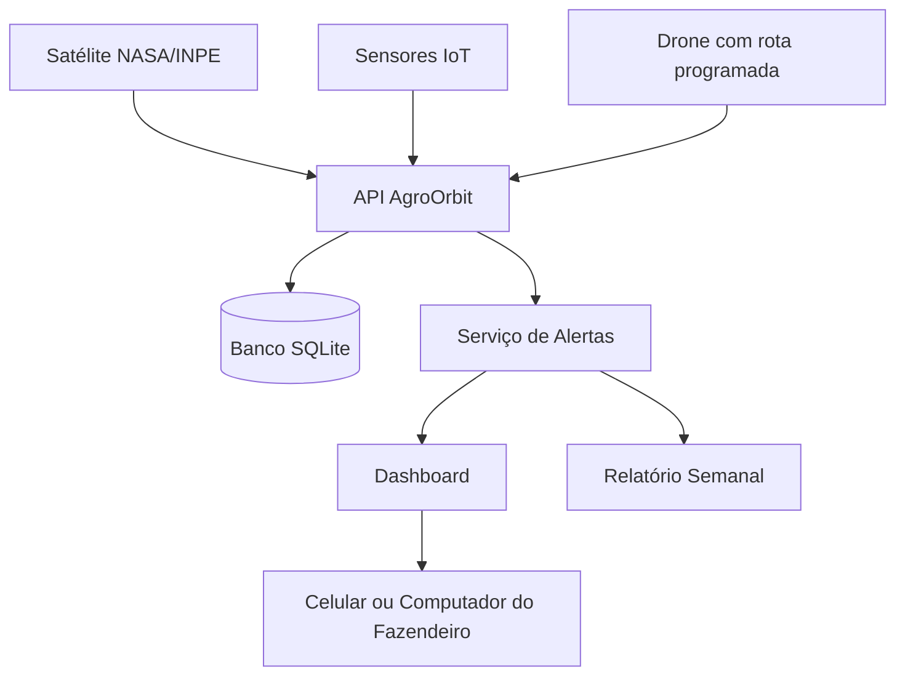

# AgroOrbit API

API em C# / .NET 8 para monitoramento agrícola inteligente com dados espaciais, IoT e drones.

## Solução

O agronegócio brasileiro enfrenta perdas por falta de monitoramento eficiente. Pragas e secas podem ser detectadas tarde demais, e o fazendeiro nem sempre possui visibilidade em tempo real da propriedade.

A solução proposta é uma plataforma integrada que combina satélite, IoT e drones para dar ao fazendeiro controle da fazenda pelo celular ou computador.

## Como funciona

1. Monitoramento da lavoura por satélite.
2. Varredura da área por drone.
3. Dashboard central com mapa, status da lavoura e histórico de alertas.
4. Relatório semanal gerado automaticamente.

## Integrantes

| Nome completo | RM |
|---|---|
| Fernanda Rocha Menon | RM554673 |
| Luiza Macena Dantas | RM556237 |
| Luan Ramos Garcia de Souza | RM558537 |
| Matheus Ricciotti | RM556930 |
| Matheus Bortolotto | RM555189 |

## Tema espacial e ODS

O projeto usa dados de satélite como parte central da solução, conectando o agronegócio brasileiro à temática espacial. A solução também se relaciona aos ODS 2, 9 e 13.

## Tecnologias

- C#
- .NET 8
- ASP.NET Core Web API
- Entity Framework Core
- SQLite
- Swagger/OpenAPI

## Requisitos atendidos

- Modelagem de domínio e POO.
- Classe abstrata `EquipamentoMonitoramento`.
- Herança com `Satelite`, `Drone` e `SensorIot`.
- Interfaces `IAlertaService`, `IDashboardService`, `IRelatorioService`, `IAnaliseImagemService` e `ITimeZoneService`.
- Manipulação de datas com `DateTime`.
- Tratamento global de exceções com `UseExceptionHandler`.
- Banco de dados SQLite com seed automático.
- Dashboard e relatório semanal.

## Como executar

```bash
git clone https://github.com/Luiza122/GSC-.git
cd GSC-/AgroOrbit.Api
dotnet restore
dotnet run --project AgroOrbit.Api
```

Abra:

```text
http://localhost:5188/swagger
```

Caso a porta exibida no terminal seja diferente, abra a URL que aparecer no `dotnet run`.

## Endpoints principais

| Método | Endpoint | Descrição |
|---|---|---|
| GET | `/api/fazendas` | Lista fazendas |
| POST | `/api/fazendas` | Cria fazenda |
| POST | `/api/fazendas/{fazendaId}/talhoes` | Cria talhão |
| GET | `/api/equipamentos` | Lista equipamentos |
| POST | `/api/equipamentos/satelites` | Cria satélite |
| POST | `/api/equipamentos/drones` | Cria drone |
| POST | `/api/equipamentos/sensores-iot` | Cria sensor IoT |
| POST | `/api/monitoramento/leituras-satelite` | Registra leitura orbital |
| POST | `/api/monitoramento/leituras-sensor` | Registra leitura IoT |
| POST | `/api/monitoramento/varreduras-drone` | Registra varredura do drone |
| GET | `/api/alertas` | Lista alertas |
| GET | `/api/dashboard/{fazendaId}` | Consulta dashboard |
| POST | `/api/relatorios/semanal/{fazendaId}` | Gera relatório semanal |

## Como testar no Swagger

A API já cria dados iniciais automaticamente quando roda pela primeira vez. Por isso, para testar os endpoints de monitoramento, use os IDs iniciais:

- `fazendaId`: 1
- `talhaoId`: 1
- `sateliteId`: 1
- `droneId`: 2
- `sensorIotId`: 3

### 1. Listar fazendas

Endpoint:

```http
GET /api/fazendas
```

Não precisa enviar JSON.

Resposta esperada:

```json
[
  {
    "id": 1,
    "nome": "Fazenda Horizonte Verde",
    "proprietario": "Grupo Agro Demo",
    "cidade": "Ribeirão Preto",
    "estado": "SP",
    "areaHectares": 1200,
    "criadaEm": "2026-06-08T10:00:00Z"
  }
]
```

### 2. Criar fazenda

Endpoint:

```http
POST /api/fazendas
```

JSON para colar no Swagger:

```json
{
  "nome": "Fazenda Santa Clara",
  "proprietario": "AgroTech Brasil",
  "cidade": "Barretos",
  "estado": "SP",
  "areaHectares": 850
}
```

Resposta esperada:

```json
{
  "id": 2,
  "nome": "Fazenda Santa Clara",
  "proprietario": "AgroTech Brasil",
  "cidade": "Barretos",
  "estado": "SP",
  "areaHectares": 850,
  "criadaEm": "2026-06-08T10:00:00Z"
}
```

### 3. Criar talhão

Endpoint:

```http
POST /api/fazendas/1/talhoes
```

JSON para colar no Swagger:

```json
{
  "nome": "Talhão Leste",
  "cultura": "Café",
  "areaHectares": 120,
  "latitude": -21.1701,
  "longitude": -47.8103
}
```

Resposta esperada:

```json
{
  "id": 3,
  "nome": "Talhão Leste",
  "cultura": "Café",
  "areaHectares": 120,
  "latitude": -21.1701,
  "longitude": -47.8103,
  "statusAtual": "Sem leitura recente",
  "fazendaId": 1
}
```

### 4. Criar satélite

Endpoint:

```http
POST /api/equipamentos/satelites
```

JSON para colar no Swagger:

```json
{
  "nome": "Satélite Sentinel Agro",
  "codigo": "SAT-002",
  "fazendaId": 1,
  "provedorImagem": "NASA/INPE",
  "revisitaHoras": 24
}
```

Resposta esperada:

```json
{
  "id": 4,
  "nome": "Satélite Sentinel Agro",
  "codigo": "SAT-002",
  "tipo": "Satelite",
  "status": "Ativo",
  "operacao": "Recebe imagens orbitais do provedor NASA/INPE a cada 24 horas."
}
```

### 5. Criar drone

Endpoint:

```http
POST /api/equipamentos/drones
```

JSON para colar no Swagger:

```json
{
  "nome": "Drone AgroScan 02",
  "codigo": "DRN-002",
  "fazendaId": 1,
  "autonomiaMinutos": 50,
  "rotaPadrao": "Rota Leste/Oeste"
}
```

Resposta esperada:

```json
{
  "id": 5,
  "nome": "Drone AgroScan 02",
  "codigo": "DRN-002",
  "tipo": "Drone",
  "status": "Ativo",
  "operacao": "Realiza varredura aérea pela rota 'Rota Leste/Oeste' com autonomia de 50 minutos."
}
```

### 6. Criar sensor IoT

Endpoint:

```http
POST /api/equipamentos/sensores-iot
```

JSON para colar no Swagger:

```json
{
  "nome": "Sensor Solo 02",
  "codigo": "IOT-002",
  "fazendaId": 1,
  "grandezaMonitorada": "Umidade do solo e temperatura"
}
```

Resposta esperada:

```json
{
  "id": 6,
  "nome": "Sensor Solo 02",
  "codigo": "IOT-002",
  "tipo": "SensorIot",
  "status": "Ativo",
  "operacao": "Coleta dados de Umidade do solo e temperatura em tempo real por IoT."
}
```

### 7. Listar equipamentos

Endpoint:

```http
GET /api/equipamentos
```

Não precisa enviar JSON.

Esse endpoint mostra satélites, drones e sensores cadastrados.

### 8. Registrar leitura de satélite com alerta

Endpoint:

```http
POST /api/monitoramento/leituras-satelite
```

JSON para colar no Swagger:

```json
{
  "talhaoId": 1,
  "sateliteId": 1,
  "indiceSaude": 0.38,
  "umidadeEstimada": 22,
  "capturadoEmUtc": "2026-06-08T10:00:00Z"
}
```

Resposta esperada:

```json
{
  "leitura": {
    "id": 2,
    "talhaoId": 1,
    "sateliteId": 1,
    "indiceSaude": 0.38,
    "umidadeEstimada": 22,
    "capturadoEmUtc": "2026-06-08T10:00:00Z"
  },
  "alertasGerados": 2,
  "alertas": [
    {
      "tipo": "Praga",
      "nivel": "Alto",
      "mensagem": "Satelite detectou queda no indice de saude da lavoura."
    },
    {
      "tipo": "Seca",
      "nivel": "Critico",
      "mensagem": "Satelite identificou baixa umidade e risco de seca."
    }
  ]
}
```

### 9. Registrar leitura de sensor IoT

Endpoint:

```http
POST /api/monitoramento/leituras-sensor
```

JSON para colar no Swagger:

```json
{
  "talhaoId": 1,
  "sensorIotId": 3,
  "umidadeSolo": 21,
  "temperatura": 39,
  "capturadoEmUtc": "2026-06-08T11:00:00Z"
}
```

Resposta esperada:

```json
{
  "leitura": {
    "id": 2,
    "talhaoId": 1,
    "sensorIotId": 3,
    "umidadeSolo": 21,
    "temperatura": 39,
    "capturadoEmUtc": "2026-06-08T11:00:00Z"
  },
  "alertasGerados": 2
}
```

### 10. Registrar varredura do drone

Endpoint:

```http
POST /api/monitoramento/varreduras-drone
```

JSON para colar no Swagger:

```json
{
  "talhaoId": 1,
  "droneId": 2,
  "urlImagem": "imagens/drone/talhao-1-analise.jpg",
  "percentualAnomalia": 32,
  "capturadoEmUtc": "2026-06-08T12:00:00Z"
}
```

Resposta esperada:

```json
{
  "varredura": {
    "id": 2,
    "talhaoId": 1,
    "droneId": 2,
    "urlImagem": "imagens/drone/talhao-1-analise.jpg",
    "percentualAnomalia": 32,
    "capturadoEmUtc": "2026-06-08T12:00:00Z"
  },
  "alertasGerados": 1
}
```

### 11. Listar alertas

Endpoint:

```http
GET /api/alertas
```

Não precisa enviar JSON.

Resposta esperada:

```json
[
  {
    "id": 1,
    "fazendaId": 1,
    "talhaoId": 1,
    "tipo": "Seca",
    "nivel": "Critico",
    "mensagem": "Satelite identificou baixa umidade e risco de seca.",
    "status": "Aberto"
  }
]
```

### 12. Consultar dashboard

Endpoint:

```http
GET /api/dashboard/1
```

Não precisa enviar JSON.

Resposta esperada:

```json
{
  "fazendaId": 1,
  "fazenda": "Fazenda Horizonte Verde",
  "totalTalhoes": 2,
  "alertasAbertos": 3,
  "mediaSaudeLavoura": 0.60,
  "talhoes": [],
  "ultimosAlertas": []
}
```

### 13. Gerar relatório semanal

Endpoint:

```http
POST /api/relatorios/semanal/1
```

Não precisa enviar JSON.

Resposta esperada:

```json
{
  "id": 1,
  "fazendaId": 1,
  "totalAlertas": 3,
  "mediaSaude": 0.60,
  "resumo": "No periodo analisado, a fazenda apresentou 3 alerta(s) e media de saude 0,60."
}
```

## Ordem recomendada para apresentar no vídeo ou prints

1. Abrir o Swagger.
2. Executar `GET /api/fazendas`.
3. Executar `GET /api/equipamentos`.
4. Executar `POST /api/monitoramento/leituras-satelite` com índice de saúde baixo.
5. Executar `GET /api/alertas`.
6. Executar `GET /api/dashboard/1`.
7. Executar `POST /api/relatorios/semanal/1`.

Essa sequência mostra o fluxo completo: dados iniciais, monitoramento por satélite, geração de alerta, dashboard e relatório.

## Diagrama de arquitetura



## Evidências de execução

As evidências ficam em `docs/evidencias-execucao.md`, com comandos, endpoints e exemplos de retorno.

Para a entrega, tire prints do Swagger aberto e dos endpoints sendo executados com os JSONs desta documentação.
