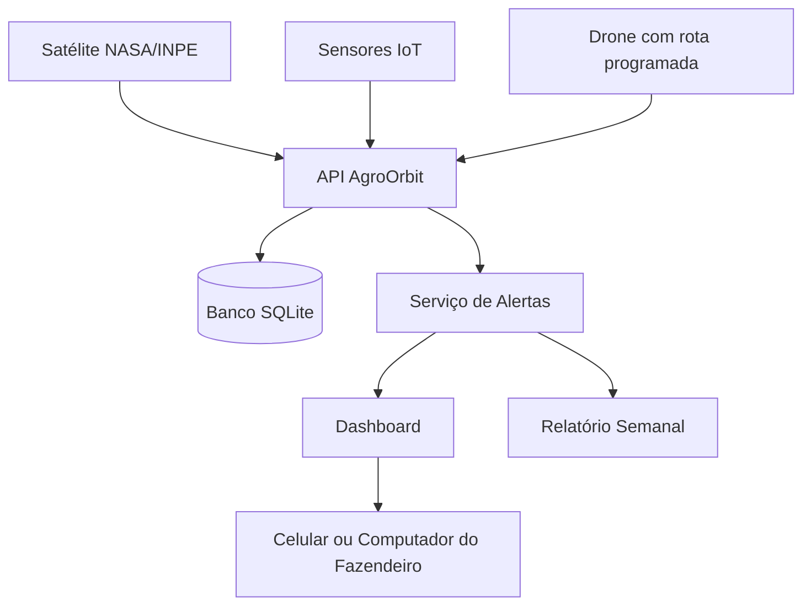

# AgroOrbit API

API em C# / .NET 8 para monitoramento agrícola inteligente com dados espaciais, IoT e drones.

## Solução

O agronegócio brasileiro enfrenta perdas por falta de monitoramento eficiente. Pragas e secas podem ser detectadas tarde demais, e o fazendeiro nem sempre possui visibilidade em tempo real da propriedade.

A solução proposta é uma plataforma integrada que combina satélite, IoT e drones para dar ao fazendeiro controle da fazenda pelo celular ou computador.

## Como funciona

1. Monitoramento da lavoura por satélite.
2. Varredura da área por drone.
3. Dashboard central com mapa, status da lavoura e histórico de alertas.
4. Relatório semanal gerado automaticamente.

## Integrantes

| Nome completo | RM |
|---|---|
| Luiza Macena Dantas | RM556237 |
| Fernanda Rocha Menon | RM554673 |
| Luan Ramos Garcia de Souza | RM558537 |
| Matheus Ricciotti | RM556930 |
| Matheus Bortolotto | RM555189 |

## Tema espacial e ODS

O projeto usa dados de satélite como parte central da solução, conectando o agronegócio brasileiro à temática espacial. A solução também se relaciona aos ODS 2, 9 e 13.

## Tecnologias

- C#
- .NET 8
- ASP.NET Core Web API
- Entity Framework Core
- SQLite
- Swagger/OpenAPI

## Requisitos atendidos

- Modelagem de domínio e POO.
- Classe abstrata `EquipamentoMonitoramento`.
- Herança com `Satelite`, `Drone` e `SensorIot`.
- Interfaces `IAlertaService`, `IDashboardService`, `IRelatorioService`, `IAnaliseImagemService` e `ITimeZoneService`.
- Manipulação de datas com `DateTime`.
- Tratamento de exceções com middleware global.
- Banco de dados SQLite com seed automático.
- Dashboard e relatório semanal.

## Como executar

```bash
git clone https://github.com/Luiza122/GSC-.git
cd GSC-/AgroOrbit.Api
dotnet restore
dotnet run --project AgroOrbit.Api
```

Abra:

```text
http://localhost:5188/swagger
```

## Endpoints principais

| Método | Endpoint | Descrição |
|---|---|---|
| GET | `/api/fazendas` | Lista fazendas |
| POST | `/api/fazendas` | Cria fazenda |
| POST | `/api/fazendas/{fazendaId}/talhoes` | Cria talhão |
| GET | `/api/equipamentos` | Lista equipamentos |
| POST | `/api/equipamentos/satelites` | Cria satélite |
| POST | `/api/equipamentos/drones` | Cria drone |
| POST | `/api/equipamentos/sensores-iot` | Cria sensor IoT |
| POST | `/api/monitoramento/leituras-satelite` | Registra leitura orbital |
| POST | `/api/monitoramento/leituras-sensor` | Registra leitura IoT |
| POST | `/api/monitoramento/varreduras-drone` | Registra varredura do drone |
| GET | `/api/alertas` | Lista alertas |
| GET | `/api/dashboard/{fazendaId}` | Consulta dashboard |
| POST | `/api/relatorios/semanal/{fazendaId}` | Gera relatório semanal |

## Diagrama de arquitetura



## Evidências de execução

As evidências ficam em `docs/evidencias-execucao.md`, com comandos, endpoints e exemplos de retorno.
