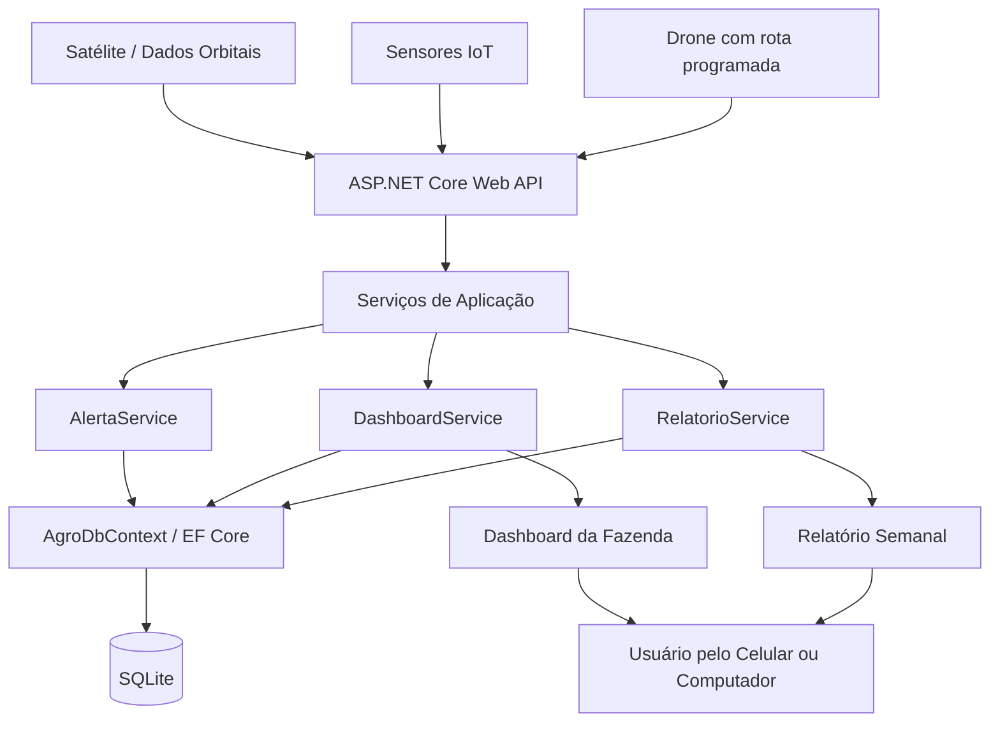

# AgroOrbit API

API em **C# / .NET 8** para monitoramento agrícola com satélite, IoT e drones.

## Descrição

O AgroOrbit centraliza dados de fazendas, talhões, equipamentos de monitoramento e leituras da lavoura. A API registra dados de satélite, sensores IoT e varreduras de drone, gerando alertas automáticos para apoiar a tomada de decisão no campo.

A solução está relacionada ao uso de tecnologia espacial no agronegócio, com foco em monitoramento por imagens orbitais e acompanhamento da saúde da plantação.

## Integrantes

| Nome completo | RM |
|---|---|
| Fernanda Rocha Menon | RM554673 |
| Luiza Macena Dantas | RM556237 |
| Luan Ramos Garcia de Souza | RM558537 |
| Matheus Ricciotti | RM556930 |
| Matheus Bortolotto | RM555189 |

## ODS relacionados

- ODS 2 — Fome Zero e Agricultura Sustentável
- ODS 9 — Indústria, Inovação e Infraestrutura
- ODS 13 — Ação Contra a Mudança Global do Clima

## Tecnologias

- C#
- .NET 8
- ASP.NET Core Web API
- Entity Framework Core
- SQLite
- Swagger / OpenAPI

## Arquitetura do projeto

| Arquivo | Função |
|---|---|
| `Program.cs` | Configuração da API, Swagger, banco e endpoints |
| `AgroDbContext.cs` | Configuração do banco com Entity Framework Core |
| `DbSeeder.cs` | Carga inicial de dados da aplicação |
| `Requests.cs` | DTOs de entrada das requisições |
| `Responses.cs` | DTOs de saída das respostas |
| `EquipamentoMonitoramento.cs` | Classe abstrata dos equipamentos |
| `Satelite.cs` | Modelo de satélite |
| `Drone.cs` | Modelo de drone |
| `SensorIot.cs` | Modelo de sensor IoT |
| `AlertaService.cs` | Regras de geração de alertas |
| `DashboardService.cs` | Consulta consolidada da fazenda |
| `RelatorioService.cs` | Geração de relatório semanal |

## Modelagem e POO

A API utiliza a classe abstrata `EquipamentoMonitoramento`. As classes `Satelite`, `Drone` e `SensorIot` herdam essa classe base e implementam comportamentos específicos de monitoramento.

Também foram utilizadas interfaces para separar responsabilidades dos serviços:

- `IAlertaService`
- `IDashboardService`
- `IRelatorioService`
- `IAnaliseImagemService`
- `ITimeZoneService`

## Banco de dados

O banco utilizado é **SQLite**. Ao executar a aplicação pela primeira vez, o arquivo `agroorbit.db` é criado automaticamente com dados iniciais de fazendas, talhões e equipamentos.

## Como executar

Entre na pasta da API:

```bash
cd AgroOrbit.Api/AgroOrbit.Api
```

Limpe e compile o projeto:

```bash
dotnet clean
dotnet build
```

Execute a API:

```bash
dotnet run
```

Acesse o Swagger:

```text
http://localhost:5000/swagger
```

Caso outra porta apareça no terminal, utilize a URL indicada pelo `dotnet run`.

## Observação sobre o Swagger

No Swagger, os métodos aparecem traduzidos da seguinte forma:

| Método HTTP | Nome exibido no Swagger |
|---|---|
| GET | PEGAR |
| POST | PUBLICAR |
| PUT | COLOCAR |
| DELETE | EXCLUIR |

Após a correção do `Program.cs`, o Swagger exibe os métodos **GET, POST, PUT e DELETE** para o CRUD completo.

## Endpoints

| Nº | Método | Endpoint | Descrição |
|---|---|---|---|
| 1 | GET | `/` | Redireciona para o Swagger |
| 2 | GET | `/api/fazendas` | Lista todas as fazendas |
| 3 | GET | `/api/fazendas/{id}` | Busca uma fazenda por ID |
| 4 | POST | `/api/fazendas` | Cadastra uma nova fazenda |
| 5 | PUT | `/api/fazendas/{id}` | Atualiza uma fazenda |
| 6 | DELETE | `/api/fazendas/{id}` | Deleta uma fazenda |
| 7 | GET | `/api/fazendas/{fazendaId}/talhoes` | Lista os talhões de uma fazenda |
| 8 | GET | `/api/talhoes/{id}` | Busca um talhão por ID |
| 9 | POST | `/api/fazendas/{fazendaId}/talhoes` | Cadastra um talhão vinculado a uma fazenda |
| 10 | PUT | `/api/talhoes/{id}` | Atualiza um talhão |
| 11 | DELETE | `/api/talhoes/{id}` | Deleta um talhão |
| 12 | GET | `/api/equipamentos` | Lista todos os equipamentos |
| 13 | GET | `/api/equipamentos/{id}` | Busca um equipamento por ID |
| 14 | POST | `/api/equipamentos/satelites` | Cadastra um satélite |
| 15 | POST | `/api/equipamentos/drones` | Cadastra um drone |
| 16 | POST | `/api/equipamentos/sensores-iot` | Cadastra um sensor IoT |
| 17 | PUT | `/api/equipamentos/{id}/status/{status}` | Atualiza o status de um equipamento |
| 18 | DELETE | `/api/equipamentos/{id}` | Deleta um equipamento |
| 19 | POST | `/api/monitoramento/leituras-satelite` | Registra leitura de satélite |
| 20 | POST | `/api/monitoramento/leituras-sensor` | Registra leitura de sensor IoT |
| 21 | POST | `/api/monitoramento/varreduras-drone` | Registra varredura de drone |
| 22 | GET | `/api/alertas` | Lista os alertas gerados |
| 23 | GET | `/api/dashboard/{fazendaId}` | Consulta o dashboard consolidado da fazenda |
| 24 | POST | `/api/relatorios/semanal/{fazendaId}` | Gera relatório semanal da fazenda |

## Exemplos de requisição

### Criar fazenda

Endpoint:

```text
POST /api/fazendas
```

Body:

```json
{
  "nome": "Fazenda Santa Clara",
  "proprietario": "AgroTech Brasil",
  "cidade": "Barretos",
  "estado": "SP",
  "areaHectares": 850
}
```

Retorno esperado:

```text
201 Created
```

### Buscar fazenda por ID

Endpoint:

```text
GET /api/fazendas/5
```

Retorno esperado:

```text
200 OK
```

Caso a fazenda não exista:

```text
404 Not Found
```

### Atualizar fazenda

Endpoint:

```text
PUT /api/fazendas/5
```

Body:

```json
{
  "nome": "Fazenda Santa Clara Atualizada",
  "proprietario": "AgroTech Brasil Ltda.",
  "cidade": "Barretos",
  "estado": "SP",
  "areaHectares": 900
}
```

Retorno esperado:

```text
200 OK
```

### Deletar fazenda

Endpoint:

```text
DELETE /api/fazendas/5
```

Retorno esperado:

```text
204 No Content
```

## Fluxo correto para testar talhões

Para testar talhões, primeiro é necessário existir uma fazenda cadastrada.

### Criar talhão

Endpoint:

```text
POST /api/fazendas/{fazendaId}/talhoes
```

Exemplo:

```text
POST /api/fazendas/4/talhoes
```

Body:

```json
{
  "nome": "Talhão Leste",
  "cultura": "Café",
  "areaHectares": 120,
  "latitude": -21.1701,
  "longitude": -47.8103
}
```

Retorno esperado:

```text
201 Created
```

### Listar talhões de uma fazenda

Endpoint:

```text
GET /api/fazendas/4/talhoes
```

Retorno esperado:

```text
200 OK
```

### Buscar talhão por ID

Endpoint:

```text
GET /api/talhoes/4
```

Retorno esperado:

```text
200 OK
```

### Atualizar talhão

Endpoint:

```text
PUT /api/talhoes/4
```

Body:

```json
{
  "nome": "Talhão Leste Expandido",
  "cultura": "Café Arábica",
  "areaHectares": 150,
  "latitude": -21.1701,
  "longitude": -47.8103
}
```

Retorno esperado:

```text
200 OK
```

### Deletar talhão

Endpoint:

```text
DELETE /api/talhoes/4
```

Retorno esperado:

```text
204 No Content
```

## Fluxo correto para testar equipamentos

Para testar equipamentos por ID, primeiro é necessário cadastrar um equipamento.

### Criar satélite

Endpoint:

```text
POST /api/equipamentos/satelites
```

Body:

```json
{
  "nome": "Satélite Teste CRUD",
  "codigo": "SAT-CRUD-06",
  "fazendaId": 4,
  "provedorImagem": "NASA/INPE",
  "revisitaHoras": 24
}
```

Retorno esperado:

```text
201 Created
```

### Criar drone

Endpoint:

```text
POST /api/equipamentos/drones
```

Body:

```json
{
  "nome": "Drone AgroScan 02",
  "codigo": "DRN-002",
  "fazendaId": 4,
  "autonomiaMinutos": 50,
  "rotaPadrao": "Rota Leste/Oeste"
}
```

Retorno esperado:

```text
201 Created
```

### Criar sensor IoT

Endpoint:

```text
POST /api/equipamentos/sensores-iot
```

Body:

```json
{
  "nome": "Sensor Solo 02",
  "codigo": "IOT-002",
  "fazendaId": 4,
  "grandezaMonitorada": "Umidade do solo e temperatura"
}
```

Retorno esperado:

```text
201 Created
```

### Listar equipamentos

Endpoint:

```text
GET /api/equipamentos
```

Retorno esperado:

```text
200 OK
```

### Buscar equipamento por ID

Endpoint:

```text
GET /api/equipamentos/5
```

Retorno esperado:

```text
200 OK
```

Caso o equipamento não exista:

```text
404 Not Found
```

### Atualizar status de equipamento

Endpoint:

```text
PUT /api/equipamentos/9/status/EmManutencao
```

Status válidos:

```text
Ativo
EmManutencao
Inativo
```

Retorno esperado:

```text
200 OK
```

### Deletar equipamento

Endpoint:

```text
DELETE /api/equipamentos/5
```

Retorno esperado:

```text
204 No Content
```

## Exemplos de monitoramento

### Registrar leitura de satélite

Endpoint:

```text
POST /api/monitoramento/leituras-satelite
```

Body:

```json
{
  "talhaoId": 3,
  "sateliteId": 7,
  "indiceSaude": 0.38,
  "umidadeEstimada": 22,
  "capturadoEmUtc": "2026-06-08T10:00:00Z"
}
```

### Registrar leitura de sensor IoT

Endpoint:

```text
POST /api/monitoramento/leituras-sensor
```

Body:

```json
{
  "talhaoId": 3,
  "sensorIotId": 9,
  "umidadeSolo": 21,
  "temperatura": 39,
  "capturadoEmUtc": "2026-06-08T11:00:00Z"
}
```

### Registrar varredura de drone

Endpoint:

```text
POST /api/monitoramento/varreduras-drone
```

Body:

```json
{
  "talhaoId": 3,
  "droneId": 8,
  "urlImagem": "imagens/drone/talhao-1-analise.jpg",
  "percentualAnomalia": 32,
  "capturadoEmUtc": "2026-06-08T12:00:00Z"
}
```

## Consultas complementares

### Listar alertas

Endpoint:

```text
GET /api/alertas
```

Retorno esperado:

```text
200 OK
```

### Consultar dashboard

Endpoint:

```text
GET /api/dashboard/{fazendaId}
```

Exemplo:

```text
GET /api/dashboard/4
```

### Gerar relatório semanal

Endpoint:

```text
POST /api/relatorios/semanal/{fazendaId}
```

Exemplo:

```text
POST /api/relatorios/semanal/4
```

## Observações dos testes

- Os testes no Swagger comprovam que os endpoints de CRUD aparecem com GET, POST, PUT e DELETE.
- Para testar `GET`, `PUT` ou `DELETE` por ID, o registro precisa existir antes.
- Se um item já foi deletado, uma nova consulta por ID retorna `404 Not Found`.
- O retorno `204 No Content` em endpoints DELETE significa que a exclusão foi realizada com sucesso.
- A lista vazia `[]` em `GET /api/equipamentos` significa que ainda não havia equipamentos cadastrados naquele momento.
- O endpoint `PUT /api/equipamentos/{id}/status/{status}` aceita os valores `Ativo`, `EmManutencao` e `Inativo`.

## Diagrama de arquitetura


