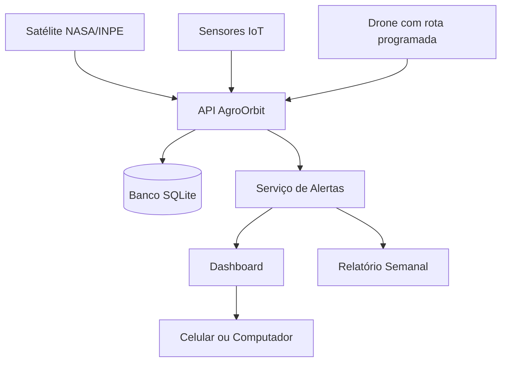

# AgroOrbit API

API em **C# / .NET 8** para monitoramento agrícola com satélite, IoT e drones.

## Descrição

O AgroOrbit centraliza dados de fazendas, talhões, equipamentos de monitoramento e leituras da lavoura. A API registra dados de satélite, sensores IoT e varreduras de drone, gerando alertas automáticos para apoiar a tomada de decisão no campo.

A solução está relacionada ao uso de tecnologia espacial no agronegócio, com foco em monitoramento por imagens orbitais e acompanhamento da saúde da plantação.

## Integrantes

| Nome completo | RM |
|---|---|
| Fernanda Rocha Menon | RM554673 |
| Luiza Macena Dantas | RM556237 |
| Luan Ramos Garcia de Souza | RM558537 |
| Matheus Ricciotti | RM556930 |
| Matheus Bortolotto | RM555189 |

## ODS relacionados

- ODS 2 — Fome Zero e Agricultura Sustentável
- ODS 9 — Indústria, Inovação e Infraestrutura
- ODS 13 — Ação Contra a Mudança Global do Clima

## Tecnologias

- C#
- .NET 8
- ASP.NET Core Web API
- Entity Framework Core
- SQLite
- Swagger / OpenAPI

## Arquitetura do projeto

| Arquivo | Função |
|---|---|
| `Program.cs` | Configuração da API e endpoints |
| `AgroDbContext.cs` | Configuração do banco com Entity Framework |
| `DbSeeder.cs` | Dados iniciais da aplicação |
| `Requests.cs` | DTOs de entrada |
| `Responses.cs` | DTOs de saída |
| `EquipamentoMonitoramento.cs` | Classe abstrata dos equipamentos |
| `Satelite.cs` | Modelo de satélite |
| `Drone.cs` | Modelo de drone |
| `SensorIot.cs` | Modelo de sensor IoT |
| `AlertaService.cs` | Regras de geração de alertas |
| `DashboardService.cs` | Consulta consolidada da fazenda |
| `RelatorioService.cs` | Geração de relatório semanal |

## Modelagem e POO

A API utiliza uma classe abstrata chamada `EquipamentoMonitoramento`. As classes `Satelite`, `Drone` e `SensorIot` herdam dessa classe base e implementam o comportamento de monitoramento.

Também foram utilizadas interfaces para separar as responsabilidades dos serviços:

- `IAlertaService`
- `IDashboardService`
- `IRelatorioService`
- `IAnaliseImagemService`
- `ITimeZoneService`

## Banco de dados

O banco utilizado é SQLite. Ao executar a aplicação pela primeira vez, o arquivo `agroorbit.db` é criado automaticamente com dados iniciais de fazenda, talhões e equipamentos.

## Como executar

```bash
git clone https://github.com/Luiza122/GSC-.git
cd GSC-/AgroOrbit.Api/AgroOrbit.Api
dotnet restore
dotnet run
```

Acesse o Swagger:

```text
http://localhost:5000/swagger
```

Caso outra porta seja exibida no terminal, utilize a URL indicada pelo `dotnet run`.

## Endpoints

| Ordem | Método | Endpoint | Descrição |
|---|---|---|---|
| 1 | GET | `/` | Redireciona para o Swagger |
| 2 | GET | `/api/fazendas` | Lista fazendas |
| 3 | POST | `/api/fazendas` | Cadastra fazenda |
| 4 | POST | `/api/fazendas/{fazendaId}/talhoes` | Cadastra talhão |
| 5 | GET | `/api/equipamentos` | Lista equipamentos |
| 6 | POST | `/api/equipamentos/satelites` | Cadastra satélite |
| 7 | POST | `/api/equipamentos/drones` | Cadastra drone |
| 8 | POST | `/api/equipamentos/sensores-iot` | Cadastra sensor IoT |
| 9 | POST | `/api/monitoramento/leituras-satelite` | Registra leitura de satélite |
| 10 | POST | `/api/monitoramento/leituras-sensor` | Registra leitura de sensor |
| 11 | POST | `/api/monitoramento/varreduras-drone` | Registra varredura de drone |
| 12 | GET | `/api/alertas` | Lista alertas |
| 13 | GET | `/api/dashboard/{fazendaId}` | Consulta dashboard |
| 14 | POST | `/api/relatorios/semanal/{fazendaId}` | Gera relatório semanal |

## Exemplos de requisição

### Criar fazenda

```json
{
  "nome": "Fazenda Santa Clara",
  "proprietario": "AgroTech Brasil",
  "cidade": "Barretos",
  "estado": "SP",
  "areaHectares": 850
}
```

### Criar talhão

Endpoint: `POST /api/fazendas/1/talhoes`

```json
{
  "nome": "Talhão Leste",
  "cultura": "Café",
  "areaHectares": 120,
  "latitude": -21.1701,
  "longitude": -47.8103
}
```

### Criar satélite

```json
{
  "nome": "Satélite Sentinel Agro",
  "codigo": "SAT-002",
  "fazendaId": 1,
  "provedorImagem": "NASA/INPE",
  "revisitaHoras": 24
}
```

### Criar drone

```json
{
  "nome": "Drone AgroScan 02",
  "codigo": "DRN-002",
  "fazendaId": 1,
  "autonomiaMinutos": 50,
  "rotaPadrao": "Rota Leste/Oeste"
}
```

### Criar sensor IoT

```json
{
  "nome": "Sensor Solo 02",
  "codigo": "IOT-002",
  "fazendaId": 1,
  "grandezaMonitorada": "Umidade do solo e temperatura"
}
```

### Registrar leitura de satélite

```json
{
  "talhaoId": 1,
  "sateliteId": 1,
  "indiceSaude": 0.38,
  "umidadeEstimada": 22,
  "capturadoEmUtc": "2026-06-08T10:00:00Z"
}
```

### Registrar leitura de sensor IoT

```json
{
  "talhaoId": 1,
  "sensorIotId": 3,
  "umidadeSolo": 21,
  "temperatura": 39,
  "capturadoEmUtc": "2026-06-08T11:00:00Z"
}
```

### Registrar varredura de drone

```json
{
  "talhaoId": 1,
  "droneId": 2,
  "urlImagem": "imagens/drone/talhao-1-analise.jpg",
  "percentualAnomalia": 32,
  "capturadoEmUtc": "2026-06-08T12:00:00Z"
}
```

## Diagrama de arquitetura


