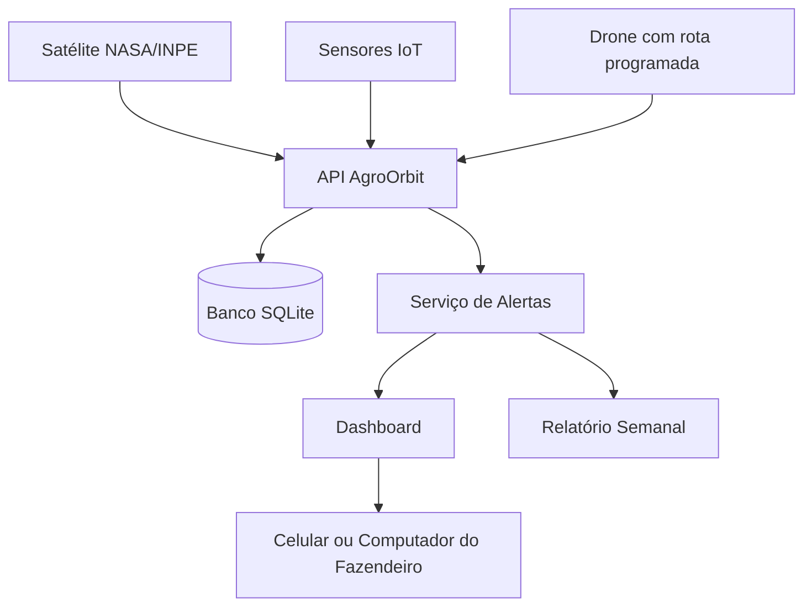

# AgroOrbit API

API em **C# / .NET 8** para monitoramento agrícola inteligente com dados espaciais, IoT e drones.

## Solução

O agronegócio brasileiro enfrenta perdas significativas por falta de monitoramento eficiente. Pragas e secas são detectadas tarde demais, e o fazendeiro não tem visibilidade em tempo real da sua propriedade.

A solução proposta é uma plataforma integrada que combina **satélite, IoT e drones** para dar ao fazendeiro controle total da fazenda pelo celular ou computador.

## Como funciona na prática

1. **Monitoramento da lavoura por satélite**  
   O sistema recebe imagens de satélite da fazenda e analisa automaticamente a saúde da plantação. Caso identifique seca ou praga chegando, o fazendeiro recebe um alerta antes que o problema gere prejuízo.

2. **Varredura da área por drone**  
   O drone realiza uma rota programada pela fazenda, tira fotos e envia os dados para o servidor. A IA processa as imagens, identifica anomalias e gera relatório automático.

3. **Dashboard central**  
   O fazendeiro acompanha tudo em uma tela: mapa da fazenda, status da lavoura, histórico de alertas e relatório semanal.

## Integrantes do grupo

| Nome completo | RM |
|---|---|
| Fernanda Rocha Menon | RM554673 |
| Luiza Macena Dantas | RM556237 |
| Luan Ramos Garcia de Souza | RM558537 |
| Matheus Ricciotti | RM556930 |
| Matheus Bortolotto | RM555189 |

## Conexão com o tema espacial

O projeto se conecta diretamente à temática espacial porque utiliza **dados de satélite** como base para o monitoramento agrícola. Imagens orbitais podem indicar queda de umidade, alteração na vegetação e riscos climáticos antes que o problema seja percebido manualmente.

## ODS relacionados

- **ODS 2 — Fome Zero e Agricultura Sustentável**: reduz perdas agrícolas.
- **ODS 9 — Indústria, Inovação e Infraestrutura**: integra satélite, IoT, drones e software.
- **ODS 13 — Ação Contra a Mudança Global do Clima**: monitora seca e riscos climáticos.

## Tecnologias utilizadas

- C#
- .NET 8
- ASP.NET Core Web API
- Entity Framework Core
- SQLite
- Swagger / OpenAPI
- Programação Orientada a Objetos

## Requisitos atendidos

- API Core em .NET 8.
- Conexão com banco de dados SQLite.
- Classes públicas, privadas e estáticas usadas de forma adequada.
- Classe abstrata `EquipamentoMonitoramento`.
- Herança com `Satelite`, `Drone` e `SensorIot`.
- Interfaces de serviços.
- Métodos coesos e modularizados.
- Uso de `DateTime` para histórico de leituras e alertas.
- Tratamento de exceções com middleware global.
- README com motivação, tecnologias, instruções, diagramas e evidências.

## Como executar

```bash
git clone https://github.com/Luiza122/GSC-.git
cd GSC-/AgroOrbit.Api
dotnet restore
dotnet run --project AgroOrbit.Api
```

Depois, abra o Swagger:

```text
http://localhost:5188/swagger
```

## Endpoints principais

| Método | Endpoint | Descrição |
|---|---|---|
| GET | `/api/fazendas` | Lista fazendas cadastradas |
| POST | `/api/fazendas` | Cadastra uma fazenda |
| POST | `/api/fazendas/{fazendaId}/talhoes` | Cadastra um talhão |
| GET | `/api/equipamentos` | Lista equipamentos |
| POST | `/api/equipamentos/satelites` | Cadastra satélite |
| POST | `/api/equipamentos/drones` | Cadastra drone |
| POST | `/api/equipamentos/sensores-iot` | Cadastra sensor IoT |
| POST | `/api/monitoramento/leituras-satelite` | Registra leitura orbital |
| POST | `/api/monitoramento/leituras-sensor` | Registra leitura IoT |
| POST | `/api/monitoramento/varreduras-drone` | Registra varredura do drone |
| GET | `/api/alertas` | Lista alertas gerados |
| GET | `/api/dashboard/{fazendaId}` | Exibe dashboard central |
| POST | `/api/relatorios/semanal/{fazendaId}` | Gera relatório semanal |

## Diagrama de arquitetura



## Evidências de execução

As evidências estão na pasta `docs`, com exemplos de comandos, endpoints chamados, retornos esperados e logs da aplicação.
