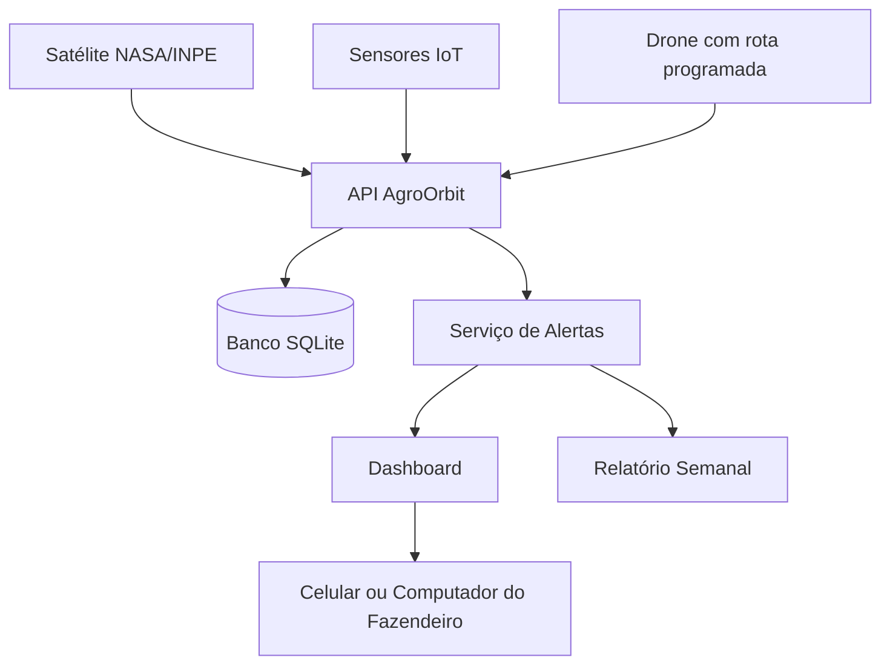

# AgroOrbit API

API em **C# / .NET 8** para monitoramento agrícola inteligente com dados espaciais, IoT e drones.

## Problema

O agronegócio brasileiro enfrenta perdas por falta de monitoramento eficiente. Pragas e secas podem ser detectadas tarde demais, e o fazendeiro nem sempre tem visibilidade em tempo real da propriedade.

## Solução

A **AgroOrbit API** integra dados de satélite, sensores IoT e drones para acompanhar a saúde da lavoura. A plataforma gera alertas automáticos, centraliza informações em dashboard e cria relatórios semanais para apoiar a tomada de decisão.

## Integrantes

| Nome completo | RM |
|---|---|
| Fernanda Rocha Menon | RM554673 |
| Luiza Macena Dantas | RM556237 |
| Luan Ramos Garcia de Souza | RM558537 |
| Matheus Ricciotti | RM556930 |
| Matheus Bortolotto | RM555189 |

## Conexão com o tema espacial e ODS

O projeto se conecta ao tema espacial porque usa dados de satélite para monitoramento agrícola. Imagens orbitais podem indicar baixa umidade, alteração na vegetação e sinais de risco antes que o problema seja percebido manualmente.

ODS relacionados:

- **ODS 2 — Fome Zero e Agricultura Sustentável**
- **ODS 9 — Indústria, Inovação e Infraestrutura**
- **ODS 13 — Ação Contra a Mudança Global do Clima**

## Tecnologias utilizadas

- C#
- .NET 8
- ASP.NET Core Web API
- Entity Framework Core
- SQLite
- Swagger/OpenAPI
- Programação Orientada a Objetos

## Requisitos do professor atendidos

| Requisito | Como foi atendido |
|---|---|
| API Core em .NET 8 | Projeto ASP.NET Core Web API |
| Banco de dados | SQLite com Entity Framework Core |
| POO | Entidades do domínio agrícola e espacial |
| Herança | `Satelite`, `Drone` e `SensorIot` herdam de `EquipamentoMonitoramento` |
| Classe abstrata | `EquipamentoMonitoramento` |
| Interfaces | `IAlertaService`, `IDashboardService`, `IRelatorioService`, `IAnaliseImagemService`, `ITimeZoneService` |
| Datas | Uso de `DateTime` em leituras, alertas e relatórios |
| Exceções | Tratamento global com `UseExceptionHandler` |
| Organização | Código separado em entidades, serviços, DTOs e banco |
| Diagrama | Diagrama de arquitetura no README |
| Evidências | Roteiro de prints no README e em `docs/evidencias-execucao.md` |

## Como executar

```bash
git clone https://github.com/Luiza122/GSC-.git
cd GSC-/AgroOrbit.Api/AgroOrbit.Api
dotnet restore
dotnet run
```

Depois, abra o Swagger no navegador:

```text
http://localhost:5000/swagger
```

Se aparecer outra porta no terminal, use a porta indicada pelo `dotnet run`.

## Dados iniciais criados automaticamente

Ao iniciar a API, o banco SQLite é criado automaticamente com dados de teste:

- `fazendaId`: 1
- `talhaoId`: 1
- `sateliteId`: 1
- `droneId`: 2
- `sensorIotId`: 3

Use esses IDs nos testes do Swagger.

## Endpoints principais

| Método | Endpoint | Descrição |
|---|---|---|
| GET | `/api/fazendas` | Lista fazendas |
| POST | `/api/fazendas` | Cria fazenda |
| POST | `/api/fazendas/{fazendaId}/talhoes` | Cria talhão |
| GET | `/api/equipamentos` | Lista equipamentos |
| POST | `/api/equipamentos/satelites` | Cria satélite |
| POST | `/api/equipamentos/drones` | Cria drone |
| POST | `/api/equipamentos/sensores-iot` | Cria sensor IoT |
| POST | `/api/monitoramento/leituras-satelite` | Registra leitura orbital |
| POST | `/api/monitoramento/leituras-sensor` | Registra leitura IoT |
| POST | `/api/monitoramento/varreduras-drone` | Registra varredura do drone |
| GET | `/api/alertas` | Lista alertas |
| GET | `/api/dashboard/{fazendaId}` | Consulta dashboard |
| POST | `/api/relatorios/semanal/{fazendaId}` | Gera relatório semanal |

## Como testar no Swagger

### 1. Listar fazendas

Endpoint:

```http
GET /api/fazendas
```

Não precisa enviar JSON.

### 2. Criar fazenda

Endpoint:

```http
POST /api/fazendas
```

JSON para enviar:

```json
{
  "nome": "Fazenda Santa Clara",
  "proprietario": "AgroTech Brasil",
  "cidade": "Barretos",
  "estado": "SP",
  "areaHectares": 850
}
```

Não envie `id` nem `criadaEm`, pois esses campos são gerados pela API.

### 3. Criar talhão

Endpoint:

```http
POST /api/fazendas/1/talhoes
```

No campo `fazendaId`, informe:

```text
1
```

JSON para enviar:

```json
{
  "nome": "Talhão Leste",
  "cultura": "Café",
  "areaHectares": 120,
  "latitude": -21.1701,
  "longitude": -47.8103
}
```

### 4. Criar satélite

Endpoint:

```http
POST /api/equipamentos/satelites
```

JSON para enviar:

```json
{
  "nome": "Satélite Sentinel Agro",
  "codigo": "SAT-002",
  "fazendaId": 1,
  "provedorImagem": "NASA/INPE",
  "revisitaHoras": 24
}
```

### 5. Criar drone

Endpoint:

```http
POST /api/equipamentos/drones
```

JSON para enviar:

```json
{
  "nome": "Drone AgroScan 02",
  "codigo": "DRN-002",
  "fazendaId": 1,
  "autonomiaMinutos": 50,
  "rotaPadrao": "Rota Leste/Oeste"
}
```

### 6. Criar sensor IoT

Endpoint:

```http
POST /api/equipamentos/sensores-iot
```

JSON para enviar:

```json
{
  "nome": "Sensor Solo 02",
  "codigo": "IOT-002",
  "fazendaId": 1,
  "grandezaMonitorada": "Umidade do solo e temperatura"
}
```

### 7. Listar equipamentos

Endpoint:

```http
GET /api/equipamentos
```

Não precisa enviar JSON.

### 8. Registrar leitura de satélite com geração de alerta

Endpoint:

```http
POST /api/monitoramento/leituras-satelite
```

JSON para enviar:

```json
{
  "talhaoId": 1,
  "sateliteId": 1,
  "indiceSaude": 0.38,
  "umidadeEstimada": 22,
  "capturadoEmUtc": "2026-06-08T10:00:00Z"
}
```

Resultado esperado: a API retorna `alertasGerados` e cria alertas de seca/praga.

### 9. Registrar leitura de sensor IoT

Endpoint:

```http
POST /api/monitoramento/leituras-sensor
```

JSON para enviar:

```json
{
  "talhaoId": 1,
  "sensorIotId": 3,
  "umidadeSolo": 21,
  "temperatura": 39,
  "capturadoEmUtc": "2026-06-08T11:00:00Z"
}
```

Resultado esperado: a API retorna `alertasGerados`.

### 10. Registrar varredura do drone

Endpoint:

```http
POST /api/monitoramento/varreduras-drone
```

JSON para enviar:

```json
{
  "talhaoId": 1,
  "droneId": 2,
  "urlImagem": "imagens/drone/talhao-1-analise.jpg",
  "percentualAnomalia": 32,
  "capturadoEmUtc": "2026-06-08T12:00:00Z"
}
```

Resultado esperado: a API retorna `alertasGerados`.

### 11. Listar alertas

Endpoint:

```http
GET /api/alertas
```

Não precisa enviar JSON.

### 12. Consultar dashboard

Endpoint:

```http
GET /api/dashboard/1
```

Não precisa enviar JSON.

### 13. Gerar relatório semanal

Endpoint:

```http
POST /api/relatorios/semanal/1
```

Não precisa enviar JSON.

## Evidências de execução

Além do código, a entrega deve mostrar que a API foi executada. As evidências podem ser prints ou vídeo curto. Recomenda-se anexar os prints no Teams ou colocar as imagens em uma pasta `docs/prints` no repositório.

### Prints obrigatórios recomendados

1. **Terminal com a API rodando**
   - Mostrar o comando `dotnet run`.
   - Mostrar a URL local, por exemplo `http://localhost:5000`.

2. **Swagger aberto**
   - Mostrar a tela `http://localhost:5000/swagger`.
   - A lista de endpoints deve aparecer.

3. **GET `/api/fazendas`**
   - Prova que o banco SQLite foi criado com seed inicial.

4. **GET `/api/equipamentos`**
   - Prova que há satélite, drone e sensor IoT cadastrados.

5. **POST `/api/monitoramento/leituras-satelite`**
   - Usar o JSON do item 8.
   - Mostrar `alertasGerados` no retorno.

6. **GET `/api/alertas`**
   - Mostrar os alertas criados automaticamente.

7. **GET `/api/dashboard/1`**
   - Mostrar o painel consolidado da fazenda.

8. **POST `/api/relatorios/semanal/1`**
   - Mostrar o relatório semanal gerado.

### Ordem recomendada para os prints ou vídeo

1. Abrir o Swagger.
2. Executar `GET /api/fazendas`.
3. Executar `GET /api/equipamentos`.
4. Executar `POST /api/monitoramento/leituras-satelite`.
5. Executar `GET /api/alertas`.
6. Executar `GET /api/dashboard/1`.
7. Executar `POST /api/relatorios/semanal/1`.

Essa sequência mostra o fluxo completo: dados iniciais, monitoramento por satélite, geração de alerta, dashboard e relatório.

## Diagrama de arquitetura


